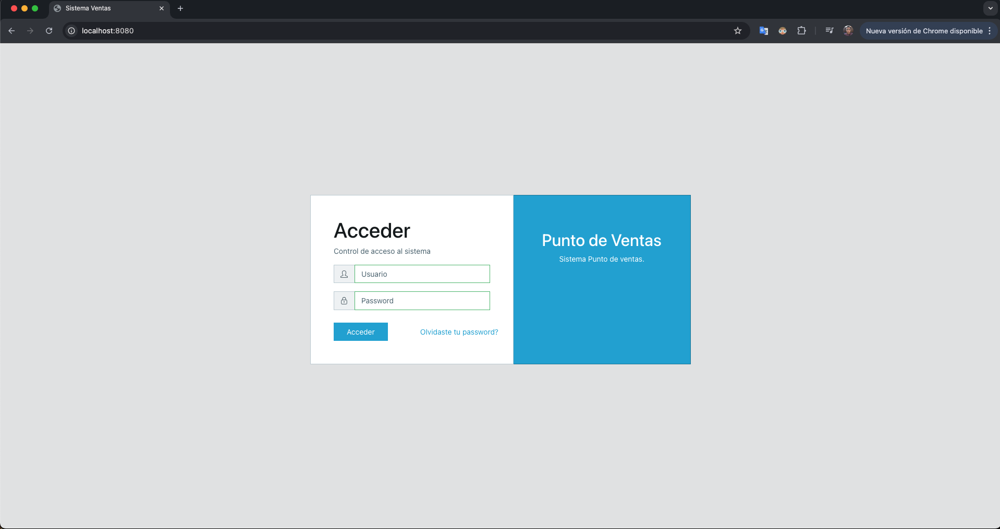

# Punto de Ventas - Sistema de Gestión Comercial


Bienvenido a este repositorio, creado con el propósito de documentar, estructurar y consolidar los conocimientos adquiridos durante el desarrollo de un sistema de Punto de Ventas (POS) utilizando Laravel como backend principal y tecnologías modernas orientadas a la comunicación en tiempo real y procesos asíncronos.

Este proyecto funciona como una guía práctica de referencia y como un recurso educativo para comprender cómo construir aplicaciones robustas, escalables y desacopladas, aplicando buenas prácticas de desarrollo profesional.

---

### 📌 ¿Por qué en español?

Este material está escrito en español debido a la limitada documentación detallada y contextualizada en este idioma sobre arquitecturas asíncronas en Laravel, especialmente cuando se integran tecnologías como Laravel Echo, Pusher, Vue.js y Axios.

El objetivo es reducir la barrera de entrada y facilitar el aprendizaje a desarrolladores que prefieren comprender los conceptos técnicos en su lengua materna.

---

### 📖 ¿Qué encontrarás aquí?

En este repositorio se abordan los aspectos clave para el desarrollo de un sistema POS moderno, incluyendo:
	•	Arquitectura base de un proyecto Laravel orientado a dominio.
	•	Diseño e implementación de APIs REST.
	•	Manejo de procesos asíncronos con Jobs, Queues y Events.
	•	Comunicación en tiempo real mediante:
	•	Laravel Echo
	•	Pusher
	•	Broadcasting
	•	Sistema de notificaciones en tiempo real.
	•	Integración de Vue.js para interfaces dinámicas.
	•	Consumo de APIs usando Axios.
	•	Manejo de estados y eventos en frontend.
	•	Control de usuarios, roles y permisos.
	•	Flujo de ventas, productos, inventarios y transacciones.
	•	Buenas prácticas de seguridad y escalabilidad.
	•	Configuración de entornos (Docker, variables de entorno, etc.).
	•	Etc…

---

### ✨ ¿Cuál es el objetivo?

El objetivo principal de este repositorio es servir como un punto de referencia claro, práctico y confiable para desarrolladores que deseen:
	•	Aprender Laravel en un contexto realista.
	•	Entender cómo funcionan los sistemas asíncronos.
	•	Implementar eventos y notificaciones en tiempo real.
	•	Construir un POS moderno, reactivo y escalable.
	•	Aplicar patrones y buenas prácticas utilizadas en proyectos profesionales.

Este proyecto no pretende ser solo un tutorial, sino una base sólida de conocimiento que pueda evolucionar y adaptarse a escenarios reales de producción.

⸻

¡Gracias por visitar este repositorio y por compartir la pasión por aprender, construir y mejorar continuamente! 🚀


## 📸 Capturas de Pantalla

 

| Vista Principal | Panel de Administración | Gestión de Productos | Reportes |
|-----------------|------------------------|----------------------|----------|
|  |  |  |  |

## 🚀 Tecnologías Utilizadas

### Backend
- **Laravel 8.x** - Framework PHP para desarrollo web
- **PHP 8.0** - Lenguaje de programación del lado del servidor
- **MySQL 8.0** - Sistema de gestión de base de datos
- **Composer** - Gestor de dependencias para PHP

### Frontend
- **CoreUI Template** - Template administrativo responsivo
- **Vue.js 2.x** - Framework JavaScript progresivo
- **Bootstrap 4** - Framework CSS
- **jQuery** - Biblioteca JavaScript
- **Axios** - Cliente HTTP para peticiones AJAX

### Desarrollo y Despliegue
- **Docker** - Contenedores para ambiente de desarrollo
- **Docker Compose** - Orquestación de contenedores
- **Nginx** - Servidor web
- **Git** - Control de versiones

### Librerías y Paquetes Laravel
- **Laravel Cashier** - Gestión de suscripciones (si aplica)
- **Laravel Excel** - Exportación e importación de Excel
- **Laravel Debugbar** - Barra de depuración
- **Spatie Permissions** - Sistema de roles y permisos

## 📋 Requisitos del Sistema

### Para Desarrollo Local (sin Docker)
- PHP 8.0 o superior
- Composer 2.x
- Node.js 16.x o superior
- MySQL 8.0
- Nginx o Apache
- Git

### Para Desarrollo con Docker
- Docker Engine 20.10 o superior
- Docker Compose 2.0 o superior
- 4GB RAM mínimo
- 10GB espacio libre en disco

## 🐳 Dockerización del Proyecto

Este proyecto ha sido configurado para ejecutarse en contenedores Docker, permitiendo un entorno de desarrollo consistente y fácil de configurar.

### Estructura de Directorios Docker Creada

```
puntoDeVentas/
├── docker/
│   ├── nginx/
│   │   └── default.conf
│   ├── php/
│   │   ├── Dockerfile
│   │   └── php.ini
│   └── mysql/
│       └── my.cnf
├── docker-compose.yml
└── .dockerignore
```

### Configuraciones Docker Detalladas

#### 1. `docker/php/Dockerfile`
- **PHP 8.0-fpm** - Imagen base compatible con Laravel 8
- Instalación de extensiones PHP necesarias (pdo_mysql, gd, zip, intl, etc.)
- Configuración de Composer 2
- Creación de usuario no-root para mejor seguridad
- Optimización de configuración PHP para desarrollo

#### 2. `docker-compose.yml`
Servicios configurados:

| Servicio | Imagen | Puerto | Descripción |
|----------|--------|--------|-------------|
| **nginx** | nginx:alpine | 8080:80 | Servidor web con configuración para Laravel |
| **php** | Personalizada (PHP 8.0) | 9000 | PHP-FPM con todas las extensiones necesarias |
| **mysql** | mysql:8.0 | 3306:3306 | Base de datos MySQL 8.0 con configuración optimizada |
| **phpmyadmin** | phpmyadmin/phpmyadmin | 8081:80 | Interfaz web para gestión de MySQL |
| **node** | node:16-alpine | - | Entorno Node.js para compilar assets |

#### 3. `docker/nginx/default.conf`
- Configuración de servidor Nginx para Laravel
- Root directory apuntando a `/var/www/public`
- Configuración para manejo de archivos PHP a través de PHP-FPM
- Reglas para caché de archivos estáticos
- Seguridad básica implementada

#### 4. `docker/php/php.ini`
- Límites aumentados para desarrollo: `upload_max_filesize=100M`
- Configuración de zona horaria: `America/Mexico_City`
- Optimización de OPcache para mejor rendimiento
- Configuración de memoria aumentada a 512M

#### 5. `docker/mysql/my.cnf`
- Configuración MySQL 8.0 con soporte para Laravel
- Character set: `utf8mb4` para soporte completo de Unicode
- Aumento de `max_allowed_packet` para mejor manejo de datos
- Configuración de `sql_mode` compatible con Laravel

#### 6. `.dockerignore` (Opcional)
- Archivos y directorios excluidos de la construcción Docker
- Incluye: node_modules, vendor, logs, archivos de configuración local
- Mejora tiempos de construcción y reduce tamaño de imagen

#### 7. Configuración del archivo `.env`
- Variables de entorno para conexión a contenedores Docker
- Configuración de base de datos apuntando a servicio `mysql`
- URLs configuradas para funcionar en contenedores
- Configuraciones de sesión y cache ajustadas

## 🛠️ Comandos Paso a Paso

### Configuración Inicial

```bash
# 1. Asegúrate de estar en el directorio del proyecto
cd ~/Proyectos/puntoDeVentas

# 2. Crear directorios Docker necesarios
mkdir -p docker/nginx docker/php docker/mysql

# 3. Crear archivos de configuración según las plantillas proporcionadas
# (Copiar el contenido de cada sección a los archivos correspondientes)
```

### Levantar el Ambiente Docker

```bash
# 1. Construir imágenes y levantar contenedores
docker-compose up -d --build

# 2. Verificar que todos los servicios estén corriendo
docker-compose ps

# 3. Ver logs en tiempo real (opcional)
docker-compose logs -f
```

### Configuración de Laravel dentro del Contenedor

```bash
# 1. Acceder al contenedor PHP
docker-compose exec php bash

# 2. Instalar dependencias de Composer (dentro del contenedor)
composer install --no-interaction --optimize-autoloader

# 3. Configurar permisos de directorios
sudo chmod -R 777 storage bootstrap/cache

# 4. Generar clave de aplicación
php artisan key:generate

# 5. Ejecutar migraciones de base de datos
php artisan migrate --seed

# 6. Limpiar cachés de configuración
php artisan config:clear
php artisan cache:clear
php artisan view:clear
```

### Comandos de Desarrollo Comunes

```bash
# Ejecutar pruebas
docker-compose exec php php artisan test

# Ejecutar migraciones específicas
docker-compose exec php php artisan migrate:fresh --seed

# Instalar dependencias NPM (para assets)
docker-compose exec node npm install
docker-compose exec node npm run dev

# Acceso a base de datos
docker-compose exec mysql mysql -u root -p
# Contraseña: root_password

# Ver logs de aplicación
docker-compose exec php tail -f storage/logs/laravel.log

# Reiniciar servicios específicos
docker-compose restart nginx php mysql

# Ver logs de un servicio
docker-compose logs nginx
docker-compose logs php
docker-compose logs mysql

# Acceder a MySQL
docker-compose exec mysql mysql -u root -p
# Contraseña: root_password

# Reinstalar dependencias
docker-compose exec php composer install
docker-compose exec node npm install
```

### Gestión de Contenedores

```bash
# Detener todos los contenedores
docker-compose down

# Detener y eliminar volúmenes (incluye datos de BD)
docker-compose down -v

# Reiniciar servicios específicos
docker-compose restart php nginx

# Ver uso de recursos
docker-compose stats

# Reconstruir un servicio específico
docker-compose up -d --build php

# Resumen facil 

| comando              | Qué hace                                            |
|----------------------|-----------------------------------------------------|
| docker-compose up    | Crea y arranca servicios                            |
| docker-compose up -d | Igual, pero en background                           |
| docker-compose stop  | Apaga contenedores                                  |
| docker-compose start | Enciende contenedores existentes.                   |
| docker-compose down  | Apaga y elimina contenedores                        |

```

## 🌐 Acceso a los Servicios

| Servicio | URL | Credenciales (si aplica) |
|----------|-----|---------------------------|
| **Aplicación Laravel** | http://localhost:8080 | - |
| **phpMyAdmin** | http://localhost:8081 | Usuario: `root`<br>Contraseña: `root_password` |
| **MySQL Directo** | localhost:3306 | Usuario: `root`<br>Contraseña: `root_password` |


## 📁 Estructura del Proyecto

```
app/
├── Console/          # Comandos Artisan personalizados
├── Exceptions/       # Manejo de excepciones
├── Http/
│   ├── Controllers/  # Controladores de la aplicación
│   ├── Middleware/   # Middleware personalizado
│   └── Requests/     # Form Requests para validación
├── Models/           # Modelos Eloquent
├── Providers/        # Service Providers
└── Services/         # Clases de servicio

config/              # Configuraciones de la aplicación
database/
├── factories/       # Factories para pruebas
├── migrations/      # Migraciones de base de datos
└── seeders/         # Seeders para datos iniciales

public/              # Archivos públicos (assets compilados)
resources/
├── js/              # Archivos JavaScript (Vue.js)
├── sass/            # Estilos SCSS
└── views/           # Vistas Blade

routes/              # Definición de rutas
storage/             # Archivos subidos, logs, cache
tests/               # Pruebas automatizadas
```

## 🔧 Características del Sistema

### Módulos Implementados
- ✅ Gestión de productos y categorías
- ✅ Control de inventario
- ✅ Ventas y facturación
- ✅ Clientes y proveedores
- ✅ Reportes y estadísticas
- ✅ Usuarios y permisos
- ✅ Configuración del sistema

### Características Técnicas
- Arquitectura MVC
- Autenticación integrada de Laravel
- Sistema de roles y permisos
- API RESTful
- Exportación a Excel/PDF
- Búsqueda y filtros avanzados
- Notificaciones en tiempo real
- Caché optimizado

## 🐛 Solución de Problemas Comunes

### Problema: Permisos de directorios
```bash
# Desde el host (fuera de Docker)
sudo chown -R $USER:www-data storage bootstrap/cache
sudo chmod -R 775 storage bootstrap/cache
```

### Problema: Conexión a base de datos
```bash
# Verificar que MySQL esté corriendo
docker-compose ps mysql

# Probar conexión desde PHP
docker-compose exec php php artisan migrate:status
```

### Problema: Puerto 8080 en uso
```yaml
# Editar docker-compose.yml y cambiar:
nginx:
  ports:
    - "8082:80"  # Cambiar a puerto disponible
```

# Notas importantes:
Sincronización de archivos: Tus cambios en ~/Proyectos/puntoDeVentas se reflejarán automáticamente en el contenedor gracias al volumen mapeado.

Base de datos persistente: Los datos de MySQL se guardan en un volumen llamado db_data.

Si tienes problemas de permisos: Ejecuta desde tu máquina local:

```bash
sudo chown -R $USER:www-data storage bootstrap/cache
sudo chmod -R 775 storage bootstrap/cache
```
Si el proyecto usa Redis o Memcached: Necesitarás agregar esos servicios al docker-compose.yml.

Para producción: Deberías modificar las configuraciones (especialmente contraseñas y APP_DEBUG=false).

Si necesitas cambiar puertos: Modifica los puertos en la sección ports del docker-compose.yml.

## 🤝 Contribuir

1. Fork el proyecto
2. Crear una rama para tu feature (`git checkout -b feature/AmazingFeature`)
3. Commit tus cambios (`git commit -m 'Add some AmazingFeature'`)
4. Push a la rama (`git push origin feature/AmazingFeature`)
5. Abrir un Pull Request

## 📄 Licencia

Este proyecto está bajo la Licencia MIT. Ver el archivo `LICENSE` para más detalles.

## 👥 Autores

- **Luis Pérez Contreras** - *Desarrollo inicial* - [@PerezContrerasLuis](https://github.com/PerezContrerasLuis)

## 🙏 Agradecimientos

- [Laravel](https://laravel.com) - El framework PHP para artisans web
- [CoreUI](https://coreui.io) - Template administrativo
- [Docker](https://docker.com) - Plataforma de contenedores
- Todos los contribuidores que han ayudado con este proyecto

---

**Nota:** Este README se actualizará con capturas de pantalla reales y características específicas conforme el proyecto evolucione.